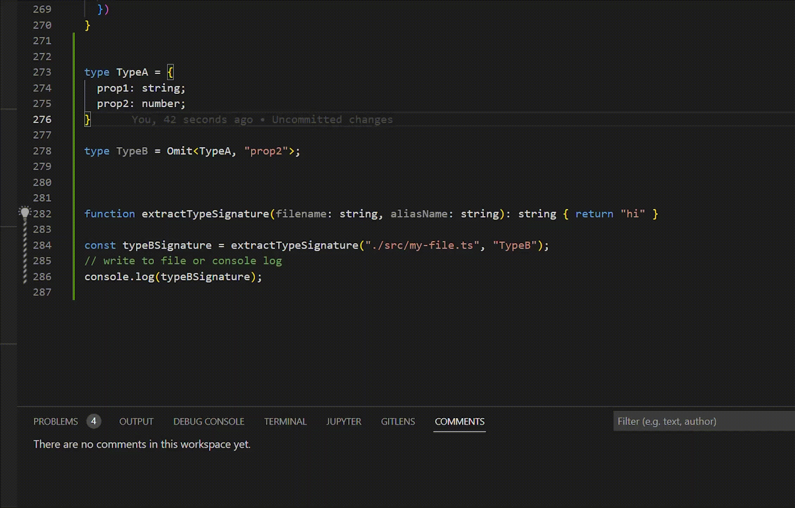
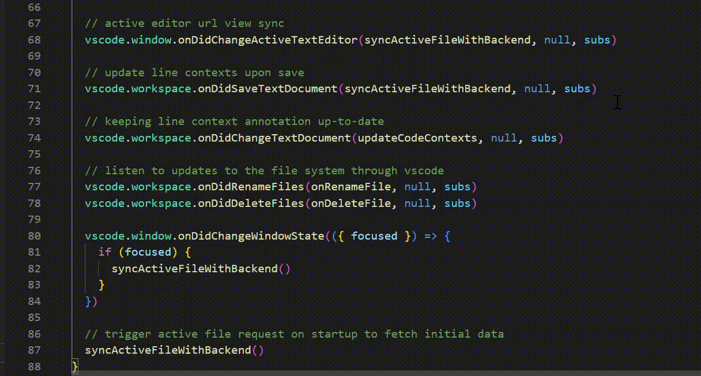
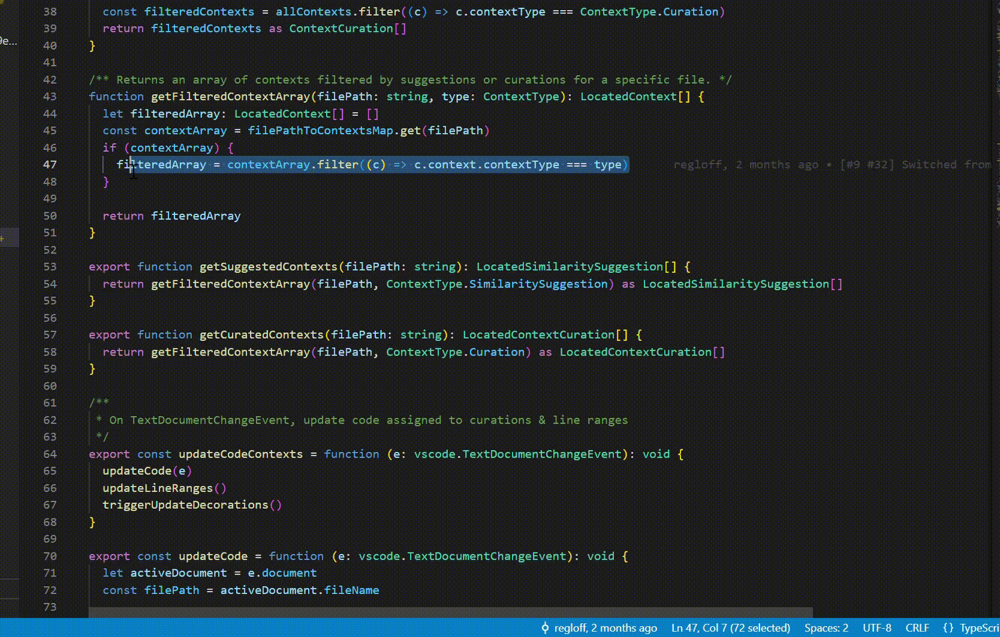
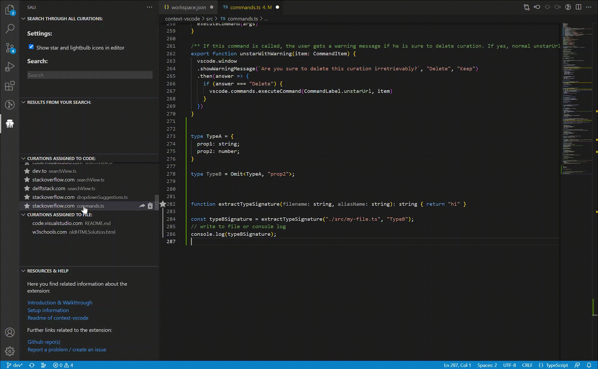

# Cheatsheet for Study Participants

## Suggestions & Curations:

### Case 1: Suggestion

When your are coding and the extension recognizes that a website you opened might match to your work, you can recognize this as a suggestion through a lightbulb on the left side of your code. You can "curate" (this means add and save) this webpage to your code through right-clicking on the respective code-line (or mark the part of the code where you want to add the curation) and assign the webpage to this code snippet. You can see assigned webpages through the star-icon on the left side of the code-snippet. The lines below the star or the lightbulb show the parts of the code that belong to a suggestion or to a curation. Curations are stored as a .yml file in a .context folder next to curated file. To use SALI collaboratively, commit these files to make them accessible to fellow developers.   

### Case 2: Add a link to a code snippet without a suggestion available:

If you want to add a link to a code snippet where no suggestion is shown, you can nonetheless assign a website to that snippet. Just mark the code to which you want to add a link, right-click, and choose the link you want to curate out of a collection of recently visited pages that might be relevant:   

**Note:**

- Single letters, words, lines and even multiple lines can be marked to add a website.
- It is also possible to manually insert a link in case where the expected link is not shown in the drop-down menu.   
     

## Preview view:

When you hover over a code snippet to which a curation was added and you click on "more information", or when you click on a curation in the maintenance view (see explanation below), the "preview" of the curation is opened on the right side. In it, you find information about the curation itself, the author that added it and a preview of the webpage. In it, you can:

- Jump to the file / code snippet where the website was assigned.
- Delete the curation.

   

## SALI maintenance view:

In the activity bar on the left side of VS Code you find the logo of our application. Clicking on it opens the "maintenance view" where you find multiple things:

- An option to toggle the star- and lightbulb icons. This is useful if you want to use the debugger while coding.
- A search functionality to search through curations.
- A list displaying all curations assigned to specific code, and one displaying curations added to specific files. If code changes to which a curation was initially added or when a file gets deleted, the curation automatically falls into this list. You can add these file-curations back to a code snippet through marking code and then clicking on the paper-clip on the right side of the curation.
- Further down you find some more resources and help about the extension.