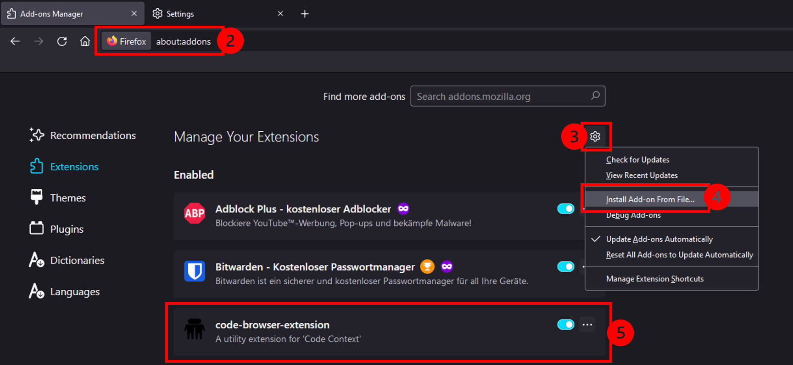

## Installation

To run SALI, you need **three different components** that have to be installed seperately on your machine:

### Electron Application

The electron application handles backend, database and the suggestion algorithm. To install it, please download and execute the respective electron app for your operation system from [this link](https://drive.google.com/drive/folders/1ZRZPlPFVNyE5DtQS1NxjQfOb4xZLk7vl?usp=sharing).

The app has to be running when you are coding. If you do not want to think about it, add it to your system's autostart:
- Add app to [Windows Autostart](https://support.microsoft.com/en-us/windows/add-an-app-to-run-automatically-at-startup-in-windows-10-150da165-dcd9-7230-517b-cf3c295d89dd)
- Add app to [Mac Autostart](https://www.idownloadblog.com/2015/03/24/apps-launch-system-startup-mac/)

### VS-Code Extension

The VS Code extension is the actual extension displayed in your IDE. Please add it from [here](https://marketplace.visualstudio.com/items?itemName=royru.sali) to your VS Code.

### Browser Extension

To be able to make suggestions based on your browser history, you must also install a browser extension to either _Firefox_ or _Chrome_.

**For Chrome users:**

1. Download the respective package from [this link](https://drive.google.com/drive/folders/1MGik2RltRwymnOimNfj-zq5nrHOsXUgO?usp=sharing).
2. Unzip the folder and save it in your preferred place on your machine. The folder must stay in your chosen location during the whole study.
3. Type/copy `chrome:extensions` into your Chrome Address Bar and open it.
4. Toggle "Developer Mode" on the upper right side.
5. Then click on "Load unpacked" and choose the unzipped folder. 
6. The extension is now added to your browser and already running.  
       

**For Firefox users:**

1. Download the respective package from [this link](https://drive.google.com/drive/folders/1MGik2RltRwymnOimNfj-zq5nrHOsXUgO?usp=sharing) and save it in your preferred place on your machine. Note that the folder must stay in your chosen location during the whole study.
2. Type/copy `about:debugging#/runtime/this-firefox` into your Firefox Address Bar and open it.
3. Press on the upper right button "Load Temporary Add-on..." and choose the zip package you saved on your machine.
4. The extension is now added to your browser and already running.  
    
